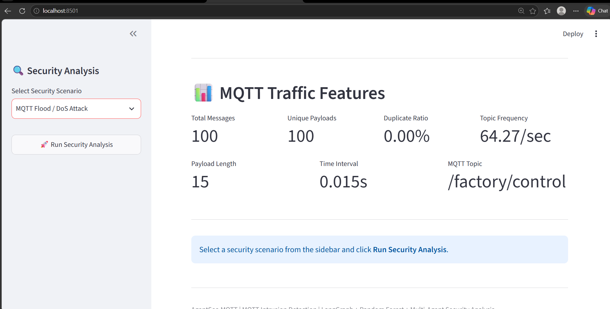
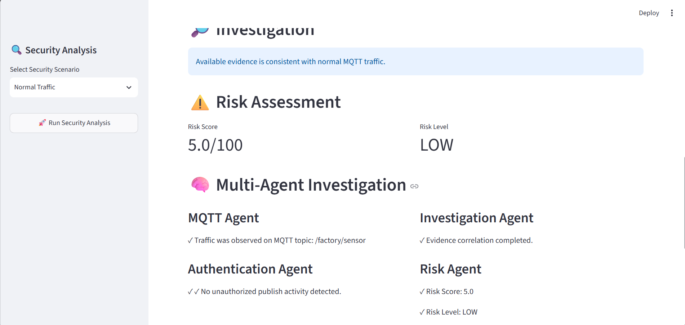
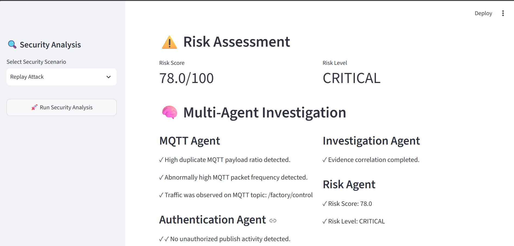
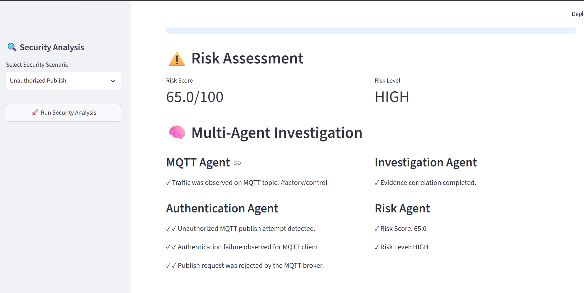
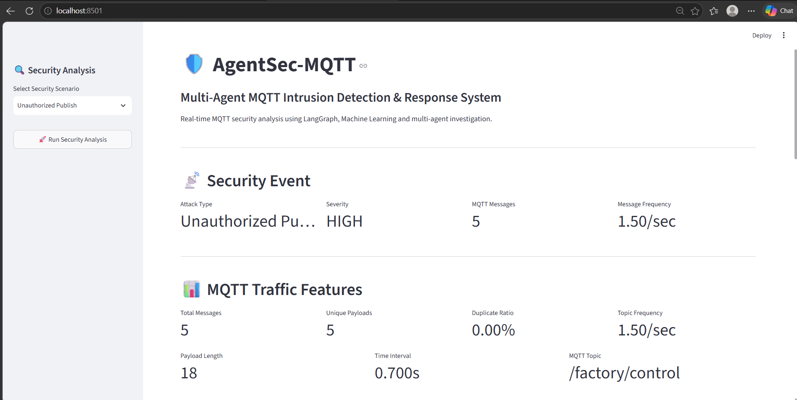

# 🚨 AGENTSEC-MQTT

## Multi-Agent AI Framework for MQTT Intrusion Detection and Security Analysis

**AGENTSEC-MQTT** is an AI-powered cybersecurity framework for detecting, investigating, assessing, and responding to security threats in **MQTT-based IoT environments**.

The system combines **MQTT traffic monitoring, feature engineering, machine learning, security-log analysis, threat intelligence, LangGraph-based multi-agent orchestration, risk assessment, and human-in-the-loop response recommendations** into an end-to-end security analysis pipeline.

---

## 🎯 Problem Statement

MQTT is widely used in IoT environments because of its lightweight communication model. However, its lightweight design can introduce security challenges when authentication, authorization, traffic control, and monitoring are insufficient.

Potential MQTT security threats include:

* MQTT Flood / Denial-of-Service attacks
* Unauthorized Publish
* Topic Spoofing
* Replay Attacks
* Brute-Force Login Attempts

Traditional monitoring approaches may detect individual suspicious events but often lack **coordinated investigation, evidence correlation, risk prioritization, and response recommendations**.

AGENTSEC-MQTT addresses this by coordinating specialized AI agents that analyze different security aspects of an MQTT event and combine their findings into a final security assessment.

---

# 💡 Proposed Solution

The framework follows a multi-stage security pipeline:

```text
MQTT Traffic
     ↓
MQTT Monitoring
     ↓
Feature Engineering
     ↓
Supervisor Agent
     ↓
Multi-Agent Security Analysis
     ↓
Machine Learning Classification
     ↓
Evidence Investigation
     ↓
Risk Assessment
     ↓
Response Recommendation
     ↓
Human Approval
```

The architecture separates individual security responsibilities into specialized agents while using a supervisor to coordinate the complete workflow.

---

# 🏗️ System Architecture

```text
                         ┌─────────────────────┐
                         │     MQTT Traffic    │
                         └──────────┬──────────┘
                                    ↓
                         ┌─────────────────────┐
                         │   MQTT Monitoring   │
                         └──────────┬──────────┘
                                    ↓
                         ┌─────────────────────┐
                         │  Feature Engineering│
                         └──────────┬──────────┘
                                    ↓
                         ┌─────────────────────┐
                         │   Supervisor Agent  │
                         └──────────┬──────────┘
                                    ↓
              ┌─────────────────────┼─────────────────────┐
              ↓                     ↓                     ↓
      ┌───────────────┐     ┌───────────────┐     ┌───────────────┐
      │  MQTT Agent   │     │  Auth Agent   │     │   Log Agent   │
      └───────┬───────┘     └───────┬───────┘     └───────┬───────┘
              │                     │                     │
              └─────────────────────┼─────────────────────┘
                                    ↓
                         ┌─────────────────────┐
                         │      ML Agent       │
                         └──────────┬──────────┘
                                    ↓
                         ┌─────────────────────┐
                         │ Investigation Agent │
                         └──────────┬──────────┘
                                    ↓
                         ┌─────────────────────┐
                         │     Risk Agent      │
                         └──────────┬──────────┘
                                    ↓
                         ┌─────────────────────┐
                         │   Response Agent    │
                         └──────────┬──────────┘
                                    ↓
                         ┌─────────────────────┐
                         │   Human Approval    │
                         └─────────────────────┘
```

---

# 🤖 Multi-Agent Architecture

### 1. Supervisor Agent

Coordinates the complete investigation workflow.

Responsibilities:

* Receives security alerts
* Determines required analysis stages
* Coordinates specialized agents
* Collects agent results
* Maintains the overall investigation flow

### 2. MQTT Agent

Analyzes MQTT traffic characteristics.

Detects indicators such as:

* Abnormally high message frequency
* Large MQTT traffic volume
* Suspicious traffic bursts
* Topic-level anomalies

### 3. Authentication Agent

Analyzes authentication and publishing activity.

It helps identify:

* Unauthorized MQTT operations
* Suspicious publishing behavior
* Authentication-related anomalies

### 4. Log Agent

Analyzes security logs to identify repeated or suspicious device activity.

Example:

```text
Repeated activity detected for device_27
```

### 5. ML Agent

Uses a trained machine-learning model to classify MQTT traffic.

The ML agent receives engineered traffic features and produces:

* Predicted attack class
* Classification confidence

### 6. Investigation Agent

Correlates evidence from multiple sources:

```text
MQTT Findings
      +
Log Findings
      +
ML Findings
      ↓
Investigation Conclusion
```

This prevents the final assessment from depending only on the ML prediction.

### 7. Risk Agent

Converts the investigation results into a security risk score.

Example:

```text
Risk Score: 90
Risk Level: CRITICAL
```

### 8. Response Agent

Generates recommended security actions according to the detected threat and risk level.

For example:

* Rate-limit MQTT messages
* Monitor the broker
* Identify the affected device
* Consider temporary containment
* Require human approval before containment

### 9. Threat Intelligence Agent

Provides additional contextual information using threat-intelligence data such as IP reputation information.

---

# ⚙️ Feature Engineering

Feature engineering is an important part of the detection pipeline.

Raw MQTT activity is transformed into numerical features that can be consumed by the machine-learning model.

The current feature set includes:

| Feature             | Description                                             |
| ------------------- | ------------------------------------------------------- |
| `total_messages`    | Total MQTT messages observed during the analysis window |
| `unique_payloads`   | Number of distinct payloads                             |
| `duplicate_ratio`   | Ratio of duplicate messages/payloads                    |
| `message_frequency` | Frequency of MQTT messages                              |
| `topic_frequency`   | Frequency of activity on the observed topic             |
| `payload_length`    | Length of MQTT payload                                  |
| `time_interval`     | Time interval between observed messages                 |

Example engineered feature vector:

```text
total_messages:   100
unique_payloads:  100
duplicate_ratio:  0.0
message_frequency: 64.27
topic_frequency:   64.27
payload_length:    15
time_interval:      0.015
```

These features allow the ML model to distinguish high-frequency anomalous MQTT behavior from normal traffic patterns.

---

# 🧠 Machine Learning Pipeline

The machine-learning pipeline follows:

```text
MQTT Traffic
     ↓
Data Collection
     ↓
Feature Extraction
     ↓
Feature Engineering
     ↓
Feature Representation
     ↓
Trained ML Model
     ↓
Traffic Classification
     ↓
Confidence Score
```

### Current Classes

The demonstrated classifier distinguishes:

* `Normal Traffic`
* `MQTT Flood / DoS Attack`

The trained model is stored locally as:

```text
ml/model.pkl
```

The model file is intentionally excluded from Git tracking where appropriate, while the training pipeline and dataset-generation code remain part of the project.

---

# 🔍 Detection Results

## Scenario 1 — MQTT Flood / DoS

Example:

```text
Total messages:       100
Message frequency:    64.27
Time interval:        0.015 seconds

Prediction:
MQTT Flood / DoS Attack

Confidence:
100%

Risk Score:
90

Risk Level:
CRITICAL
```

The investigation agent correlated MQTT, log, and ML evidence and concluded that the available evidence strongly supported the ML classification.

Recommended actions included rate limiting, continued broker monitoring, source identification, and possible temporary containment with human approval.

### Flood Attack



---

# 🟢 Scenario 2 — Normal MQTT Traffic

Example:

```text
Total messages:       20
Unique payloads:      18
Duplicate ratio:      0.1
Message frequency:    2.0
Time interval:        0.5 seconds

Prediction:
Normal Traffic

Confidence:
100%

Risk Score:
5

Risk Level:
LOW
```

The system determines that the available evidence is consistent with normal MQTT activity and recommends continued monitoring rather than immediate containment.

### Normal Traffic



---

# 🔐 Additional Security Scenarios

The project also includes simulation components for additional MQTT security scenarios.

### Replay Attack



### Unauthorized Publish



These scenarios provide a foundation for extending the ML classification and multi-agent investigation pipeline to additional MQTT attack categories.

---

# 🖥️ Streamlit Security Dashboard

The project includes a Streamlit-based dashboard for visualizing the security analysis.

The dashboard provides visibility into:

* Security alerts
* Attack classification
* ML confidence
* Risk score
* Risk level
* Agent findings
* Investigation results
* Recommended response actions

### Dashboard



Run the dashboard with:

```bash
streamlit run dashboard.py
```

Then open:

```text
http://localhost:8501
```

---

# 🧪 Demonstrated Security Workflows

## MQTT Flood / DoS

```text
MQTT Traffic
     ↓
MQTT Agent
     ↓
Feature Engineering
     ↓
ML Agent
     ↓
Investigation Agent
     ↓
Risk Agent
     ↓
Risk = 90
     ↓
CRITICAL
     ↓
Response Recommendation
```

## Normal MQTT Traffic

```text
MQTT Traffic
     ↓
MQTT Agent
     ↓
Feature Engineering
     ↓
ML Agent
     ↓
Investigation Agent
     ↓
Risk Agent
     ↓
Risk = 5
     ↓
LOW
     ↓
Continue Monitoring
```

---

# 🛡️ Human-in-the-Loop Security

AGENTSEC-MQTT follows a **human-in-the-loop security model**.

The system does not automatically execute destructive containment actions.

Instead, the response agent generates recommendations such as:

```text
Rate-limit traffic
Monitor broker
Identify affected device
Consider temporary containment
Human approval required
```

This approach reduces the risk of harmful automated actions caused by false positives or incomplete evidence.

---

# 🧰 Technology Stack

| Technology         | Purpose                             |
| ------------------ | ----------------------------------- |
| Python             | Core development                    |
| MQTT               | IoT communication protocol          |
| Mosquitto          | MQTT broker                         |
| LangGraph          | Multi-agent workflow orchestration  |
| Scikit-learn       | Machine learning                    |
| Streamlit          | Security dashboard                  |
| JSON               | Alerts and threat-intelligence data |
| Pandas             | Dataset and feature processing      |
| Wireshark concepts | MQTT traffic analysis               |

---

# 📁 Project Structure

```text
AGENTSEC-MQTT/
│
├── agents/
│   ├── auth_agent.py
│   ├── investigation_agent.py
│   ├── log_agent.py
│   ├── ml_agent.py
│   ├── mqtt_agent.py
│   ├── response_agent.py
│   ├── risk_agent.py
│   ├── supervisor.py
│   └── threat_intel_agent.py
│
├── data/
│   ├── sample_alerts.json
│   └── threat_intelligence/
│       └── ip_reputation.json
│
├── graph/
│   ├── state.py
│   └── workflow.py
│
├── ml/
│   ├── dataset.csv
│   ├── dataset_generator.py
│   └── train_model.py
│
├── mqtt_security/
│   ├── acl.conf
│   └── mosquitto.conf
│
├── screenshots/
│   ├── dashboard.png
│   ├── flood_Attack.png
│   ├── normal_traffic.png
│   ├── replay_attack.png
│   └── unauthorized_publish_attack.png
│
├── simulation/
│   ├── flood_attack.py
│   ├── mqtt_monitor.py
│   ├── mqtt_simulator.py
│   ├── replay_attack.py
│   └── unauthorized_publish.py
│
├── tools/
│   └── llm.py
│
├── dashboard.py
├── main.py
├── mqtt_detection.py
├── run_live_detection.py
├── security_event.py
├── test_workflow.py
├── requirements.txt
└── README.md
```

---

# ⚙️ Installation

Clone the repository:

```bash
git clone https://github.com/Poojithabilwa555/AGENTSEC-MQTT.git
cd AGENTSEC-MQTT
```

Create a virtual environment:

```bash
python -m venv .venv
```

Activate it on Windows:

```powershell
.venv\Scripts\activate
```

Install dependencies:

```bash
pip install -r requirements.txt
```

---

# ▶️ Running the Project

### Run the Streamlit Dashboard

```bash
streamlit run dashboard.py
```

### Run the Main Workflow

```bash
python main.py
```

### Run Workflow Tests

```bash
python test_workflow.py
```

### Run Live Detection

```bash
python run_live_detection.py
```

---

# 📊 Key Outcomes

The prototype demonstrates an end-to-end security workflow capable of:

* Monitoring MQTT traffic
* Performing feature engineering on MQTT activity
* Detecting abnormal traffic patterns
* Applying machine-learning classification
* Coordinating multiple specialized security agents
* Correlating MQTT, log, and ML evidence
* Assigning a quantitative risk score
* Generating threat-specific response recommendations
* Supporting human approval before containment

---

# 🚀 Future Improvements

The current framework can be extended with:

* Real-time MQTT packet ingestion
* Larger and more diverse MQTT attack datasets
* Multi-class attack classification
* SHAP-based ML explainability
* Real-time broker monitoring
* Persistent security-event storage
* Advanced threat-intelligence integration
* Docker-based deployment
* Cloud deployment
* SOC/SIEM integration
* Automated alert correlation
* Real-time security analytics

---

# 👩‍💻 Author

**Poojitha Vadlamudi**

B.Tech — Computer Science & Engineering

---

## ⭐ Project Focus

**AI × Cybersecurity × IoT × Multi-Agent Systems**

AGENTSEC-MQTT demonstrates how machine learning and coordinated AI agents can be combined to build an explainable, risk-aware security analysis workflow for MQTT-based IoT environments.
